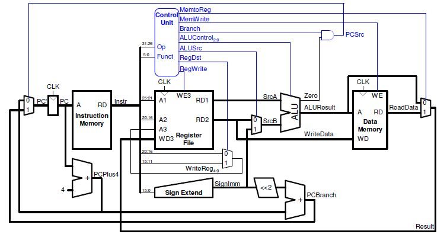

# SingleCycleProcessor

A processor that carries out one instruction in a single clock cycle.

## Getting Started

These instructions will get you a copy of the project up and running on your local machine for development and testing purposes.

### Prerequisites

```
ISE Design Suite
```

## Running the tests

Program is designed on the diagram of a single cycle processor below.




## Author

**Steven Duong**
